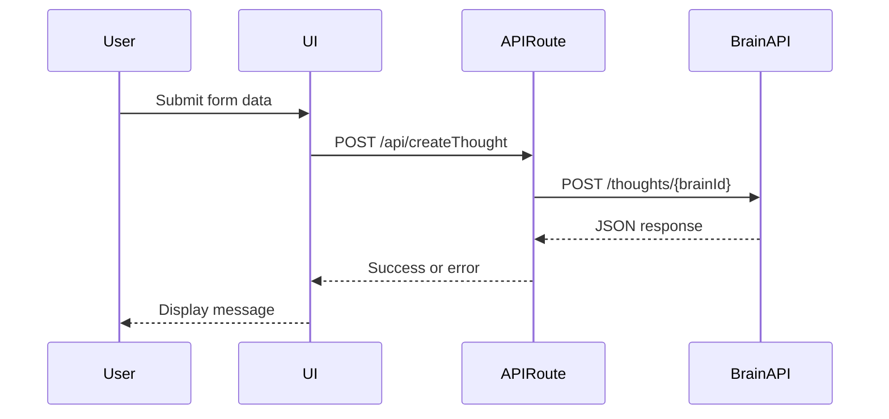

# Repository Overview
This Next.js project demonstrates how to create a new thought in TheBrain via its REST API. The example app provides a form-driven UI and a serverless API route to submit data to TheBrain service.

# Directory and File Structure
```
/ (root)
├── .env.example
├── README.md
├── next.config.js
├── package.json
├── public/
│   └── favicon.ico
├── src/
│   ├── pages/
│   │   ├── _app.js
│   │   ├── index.js
│   │   └── api/
│   │       └── createThought.js
│   └── styles/
│       └── globals.css
└── tailwind.config.js
```
- **.env.example**: Template for storing the API key.
- **next.config.js**: Next.js configuration enabling React strict mode.
- **package.json**: Dependency and script definitions.
- **public/**: Static assets served by Next.js.
- **src/pages/**: Page components and serverless API routes.
- **src/styles/**: Global Tailwind CSS styles.
- **tailwind.config.js**: Tailwind CSS configuration.

# Core Components
## UI Page (`src/pages/index.js`)
Renders the form for entering Brain ID, source thought ID, and new thought details. Validates GUID formats and displays success or error messages based on API results.

## API Route (`src/pages/api/createThought.js`)
Serverless endpoint that validates parameters, fetches an API key from environment variables, and forwards the request to TheBrain API. Provides detailed error messages when responses are non-200.

## Global App Wrapper (`src/pages/_app.js`)
Imports global styles and renders page components.

## Styling (`src/styles/globals.css` & `tailwind.config.js`)
Configures Tailwind CSS utilities and extends theme options such as radial and conic gradients.

# Data Flow or Control Flow


# External Dependencies
- **next**: React-based framework for server-side rendering and routing.
- **react / react-dom**: Core libraries for building user interfaces.
- **tailwindcss**: Utility-first CSS framework for styling.
- **postcss & autoprefixer**: CSS processing tools used by Tailwind.

# Notable Design Decisions
- Uses Next.js API routes to keep server-side API keys secure.
- Input validation for GUIDs prevents malformed requests.
- Tailwind CSS simplifies styling with utility classes and a small global stylesheet.

# Limitations or Warnings
- No automated tests are included; linting requires manual configuration.
- Application relies on a valid API key stored in environment variables.

# Error Handling
Standard analysis was possible; repository contains conventional source code without binaries or obfuscation.
